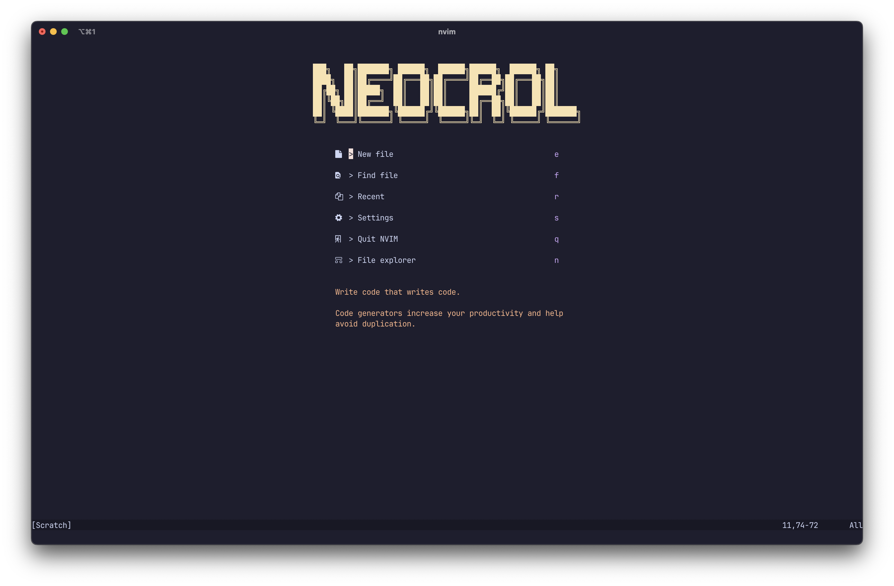

## NeoCrol



Welcome to my personalized Neovim setup, optimized for a smooth and efficient coding experience.

### Highlights:
- **Modular Structure**: Organized Lua scripts for readability and easy customization.
- **Language Support**: Automated setup for various languages using Mason.nvim.
- **Keybindings**: Streamlined shortcuts for productivity, detailed in `lua/keymappings.lua`.
- **Plugins**: Handpicked plugins managed via Lazy.nvim for enhanced functionality.

### Installation:
Clone and deploy with one command:
```
git clone https://github.com/PhenomenaPh/NvimConfig.git ~/.config/nvim --depth 1 && nvim
```

### Customization:
Feel free to modify and adapt my configuration to your own needs!
